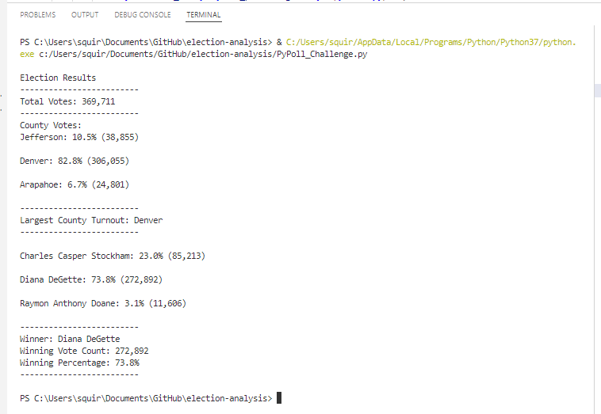

                                                                                           Michelle Werner (4/24/2022)
# Election Analysis
---

## Project Overview

A Colorado Board of Elections employee, Tom, has asked for help with an election audit of a recent local congressional election.

<!---->

Pictured: Tom's Colorado Counties
  

The tasks for this election audit of Tom's precinct are:

1. Calculate the total number of votes cast.
2. Get a complete list of candidates who received votes.
3. Calculate the total number of votes each candiate received.
4. Calculate the percentage of votes each candidate won.
5. Determine the winner of the election based on popular vote.

### Resources
* Data Source: election_results.csv
* Software: Python 3.7.9, Visual Studio Code, 1.6.6

### Summary: PseudoCode of Output / Results Description
The results of our code should generate a text file that has the following information included in it:

    Election Results:
      - There were "x" votes cast in the election

    Collect Candidates:
      - Candidate 1
      - Candidate 2
      - Candidate 3
      - etc

    Collect Counties:
      - County 1
      - County 2
      - County 3
      - etc

    Largest County Turnout:
      - Find the county with the most votes

    Candidate Results:
      - Candidate 1 received "x%" of the vote and "y" number of votes.
      - Candidate 2 received "x%" of the vote and "y" number of votes.
      - Candidate 3 received "x%" of the vote and "y" number of votes.
      - etc

    The winner of the election was:
      - Candidate (1,2, or 3), who received "y" number of votes and "x%" of the total votes.

## Challenge Overview
For this challenge, I am working with Tom to provide the above information from a dataset that Tom has supplied for his precint. If successful, the code I have writted will hopefully be able to be used to tally the same data from similar datasets for all precincts in the state.  The code I have written is described below:
 &nbsp; 
 &nbsp; 
 &nbsp; 
 
Pictured: Python code.
  

By writing Python code to run through this dataset to find and count votes for each candidate and county in the file, Tom has received the following information for his precint:

Pictured: VScode Terminal Window results from running Python code.

The Python code writes the data above to a text file as well.

Once these initial audit results are confirmed successful, Tom and the Colorado Board of Elections are hoping to collect similar data files from all Colorado precincts and use my code to automate election tabulation for all Colorado precincts.  

## Cahllenge Summary
