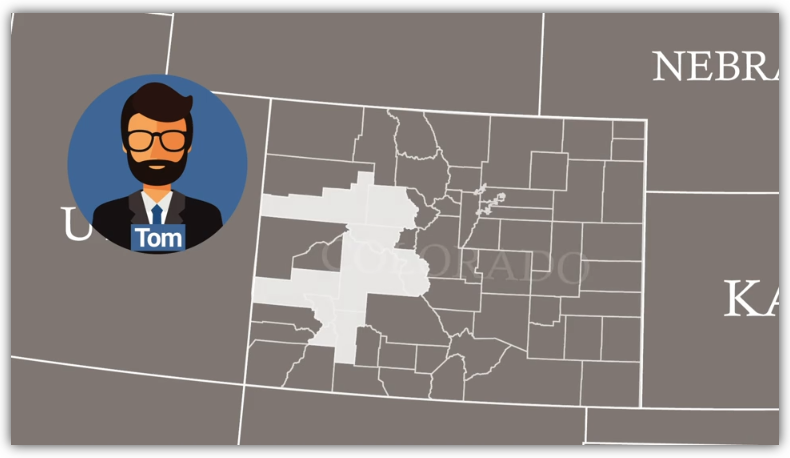

                                                                                           Michelle Werner (4/24/2022)
# Election Analysis
---

## Project Overview

A Colorado Board of Elections employee, Tom, has asked for help with an election audit of a recent local congressional election.

<!---->

Pictured: Tom's Colorado Counties
  

The tasks for this election audit of Tom's precinct are:

1. Calculate the total number of votes cast.
2. Get a complete list of candidates who received votes.
3. Calculate the total number of votes each candidate received.
4. Calculate the percentage of votes each candidate won.
5. Determine the winner of the election based on popular vote.

### Resources
* Data Source: election_results.csv
* Software: Python 3.7.9, Visual Studio Code, 1.6.6

### Summary: Pseudocode of Output / Results Description
The results of our code should generate a text file that has the following information included in it:

    Election Results:
      - There were "x" votes cast in the election

    Collect Candidates:
      - Candidate 1
      - Candidate 2
      - Candidate 3
      - etc.

    Collect Counties:
      - County 1
      - County 2
      - County 3
      - etc.

    Largest County Turnout:
      - Find the county with the most votes

    Candidate Results:
      - Candidate 1 received "x%" of the vote and "y" number of votes.
      - Candidate 2 received "x%" of the vote and "y" number of votes.
      - Candidate 3 received "x%" of the vote and "y" number of votes.
      - etc.

    The winner of the election was:
      - Candidate (1,2, or 3), who received "y" number of votes and "x%" of the total votes.

## Challenge Overview
For this challenge, I am working with Tom to provide the above information from a dataset that Tom has supplied for his precinct. If successful, the code I have written will hopefully be able to be used to tally the same data from similar datasets for all precincts in the state.  

The data Tom has provide is a .csv file that includes the following information:
 

    | Ballot ID | County  | Candidate |
    | --------- | ------- | --------- |
    | Content   | Content | Content   |

The code I have written iterates through the file looking for distinct candidates and distinct counties, then counts the votes for each. The full code is pictured and linked below, and key portions are described below the images:
  
 &nbsp;&nbsp; 
 &nbsp;&nbsp; 
 &nbsp;&nbsp; 
 
Pictured: Python code (<a href="https://github.com/miwermi/election-analysis/blob/main/summary_assets/code1.png">1</a> | <a href="https://github.com/miwermi/election-analysis/blob/main/summary_assets/code2.png">2</a> | <a href="https://github.com/miwermi/election-analysis/blob/main/summary_assets/code3.png">3</a>)
  
Key portions of the code include: connecting with the .csv file provided; using conditional if statements and storing distinct information on the candidates who were voted for and the counties where people voted; tracking and counting each ballot for each; calculating the total votes and percentage of votes; and last but not least, printing the totals to a new file for Tom.

To connect with our source file (and to designate a spot for the write file), I created the variable "file-to-load" and used the python 'os' library function "os.path.join":

    #Loads the file from path
    file_to_load = os.path.join("resources", "election_results.csv")
    #Saves the file to a path
    file_to_save = os.path.join("analysis", "election_results.txt")

Two arrays were used to store the candidate and county options, and two dictionaries were used to hold the candidate and county votes:

    #Collects candidate options and votes
    candidate_options = []
    candidate_votes = {}

    #Collects county options and votes
    county_options = []
    county_votes = {}
    
To track the votes as we count them, the 'with' statment was used (with the file open...) and then a couple of conditional 'if's for whether or not the candidate and county were new... 

    #If the candidate does not match any existing candidate...
    if candidate_name not in candidate_options:

        #Add the candidate name to the candidate list
        candidate_options.append(candidate_name)

        #Start tracking candidate's vote count
        candidate_votes[candidate_name] = 0

    #Add each vote to that candidate's count <<DO THIS
    candidate_votes[candidate_name] += 1

    #If the county does not match any existing county...
    if county_name not in county_options:

        #Add the existing county to the list of counties.
        county_options.append(county_name)

        #Start tracking the county's vote count
        county_votes[county_name] = 0

    #Add a vote to that county's vote count <<DO THIS
    county_votes[county_name] += 1
    
To calculate the percentages, we needed a couple of new variables to hold the count and candidate or county together and a line of code to designate those variables to be used as 'float' data so we could do the math. For both county and candidate totals, these were done in 'for' loops:

  for county_name in county_votes:

      #Retrieve the county vote count
      covotes = county_votes.get(county_name)

      #Calculate the percentage of votes for the county
      covote_percentage = float(covotes) / float(total_covotes) * 100
      county_results = (
          f"{county_name}: {covote_percentage:.1f}% ({covotes:,})\n")    

  for candidate_name in candidate_votes:

      #Retrieve the candidate vote count and percentage
      votes = candidate_votes.get(candidate_name)

      #Calculate the percentage of votes for the candidate
      vote_percentage = float(votes) / float(total_votes) * 100
      candidate_results = (
          f"{candidate_name}: {vote_percentage:.1f}% ({votes:,})\n")
          
          

            
## Challenge Summary

By writing Python code to run through this dataset to find and count votes for each candidate and county in the file, Tom has received the following information for his precinct:

    Election Results
    -------------------------
    Total Votes: 369,711
    -------------------------
    County Votes:
    Jefferson: 10.5% (38,855)
    Denver: 82.8% (306,055)
    Arapahoe: 6.7% (24,801)
    -------------------------
    Largest County Turnout: Denver
    -------------------------
    Charles Casper Stockham: 23.0% (85,213)
    Diana DeGette: 73.8% (272,892)
    Raymon Anthony Doane: 3.1% (11,606)
    -------------------------
    Winner: Diana DeGette
    Winning Vote Count: 272,892
    Winning Percentage: 73.8%
    -------------------------

Pictured: VScode Terminal Window results from running Python code. (<a href="https://github.com/miwermi/election-analysis/blob/main/summary_assets/VStermina.png">PNG</a> | <a href="https://github.com/miwermi/election-analysis/blob/main/results/election-results.txt">TXT</a>)

The Python code displays the code on screen during program run, but also writes the data above to a text file (linked above), which is far more useful to Tom and his constituents. 

Once these initial audit results are confirmed successful, Tom and the Colorado Board of Elections are hoping to collect similar data files from all Colorado precincts and use my code to automate election tabulation for all of Colorado, very exciting!  

Ideally, this code would also search for distinct Ballot IDs -- and ultimately Voter IDs, if we were able to gather and use that information. Since elections are typically anonymous, there is always a likely margin of error (especially when independent units - districts, states, etc - do not use the same standard to ID voters or the same standard for ballots).  Voter IDs and Ballot IDs will most likely never be stored in the same data source as the voting information. I would feel much better about my code if that data could be collected and I could run a few queries to find duplicates or quirkly looking anomalies. 

But that is always the dream... :)
